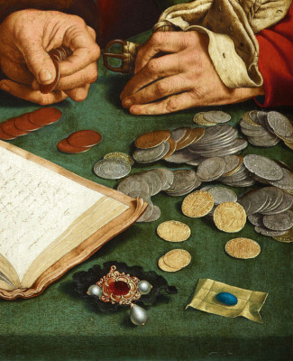
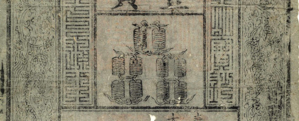
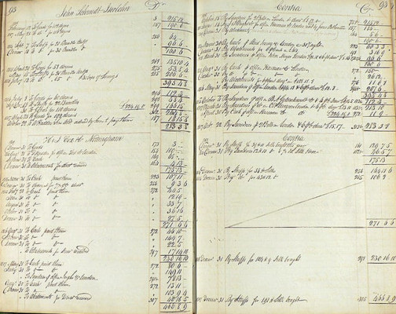
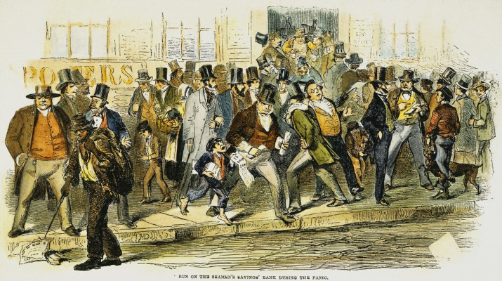
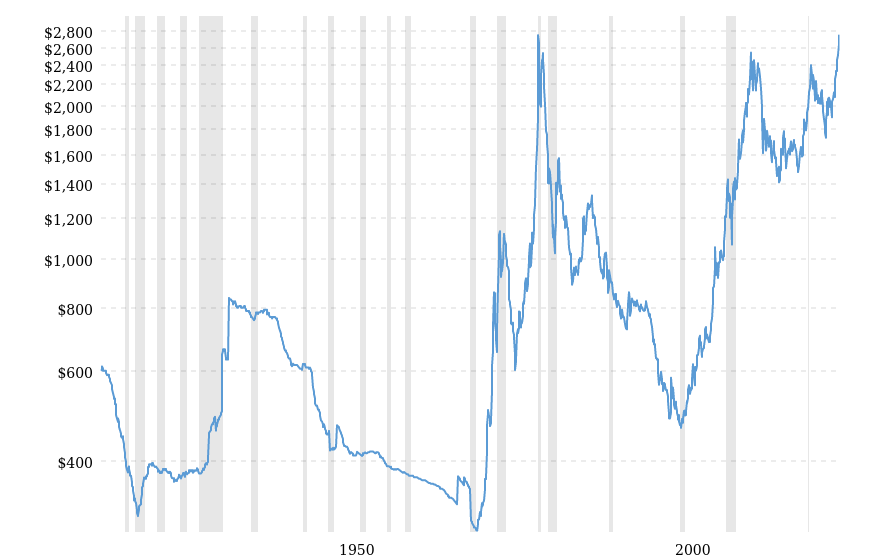

# Historia de los sistemas de pago

## 1. Trueque de bienes

En las primeras civilizaciones, las transacciones se basaban en el trueque, donde bienes y servicios se intercambiaban directamente. Sin embargo, este sistema presentaba limitaciones, como la necesidad de coincidencia entre las necesidades de los involucrados.

## 2. Metales preciosos

Con el tiempo, los metales preciosos, especialmente el *oro*, comenzaron a ser utilizados como medio de intercambio. El oro era altamente valorado por su **escasez**, **durabilidad** y **facilidad de transporte**. Su uso **estandarizado** y **universal** como moneda marcó un avance importante en las economías, permitiendo el comercio a mayor escala.

## 3. Efectivo

Posteriormente, surgió el uso de dinero en papel, o efectivo, como representación del valor de los metales preciosos. Este cambio fue impulsado por la necesidad de un sistema más práctico para manejar grandes cantidades de riqueza. Inicialmente, los billetes representaban depósitos de oro o plata almacenados en instituciones confiables, lo que facilitaba la **seguridad** y el transporte.

## 4. Cuentas bancarias

Las cuentas bancarias surgieron como una solución práctica y segura frente a los riesgos y limitaciones de guardar todo el dinero en efectivo. Mantener grandes cantidades de efectivo implicaba un alto riesgo de robo, pérdida o deterioro. Además, el efectivo no ofrecía ninguna forma de generar interés o crecer con el tiempo. Los bancos comenzaron a ofrecer cuentas para proporcionar un lugar seguro donde las personas pudieran depositar su dinero, con la ventaja adicional de permitir transacciones más cómodas y registros claros.

## 5. Reserva fraccional

Gradualmente, el sistema evolucionó hacia la banca de reserva fraccional. En este modelo, los bancos solo guardan una fracción de los depósitos como reserva, utilizando el resto para otorgar préstamos generando intereses. Esto permitió un crecimiento económico más dinámico, pero introdujo riesgos como los **pánicos bancarios**.

Los pánicos bancarios ocurren cuando un gran número de clientes retiran simultáneamente sus depósitos debido al temor de que el banco no tenga suficiente liquidez para cumplir con sus obligaciones.

### 6. Bancos centrales

El primer banco central, el banco central de Suecia, se formo para regular el sistema de reserva fraccionaria y reducir la incidencia de crisis bancarias. En un sistema donde los bancos solo mantienen una fracción de los depósitos en reserva, era crucial contar con una institución que pudiera supervisar las prácticas bancarias y actuar como prestamista de última instancia. Esto ayudaba a mantener la estabilidad financiera, prevenir pánicos bancarios y garantizar la **confianza** del público en el sistema monetario.

Los bancos centrales gradualmente monopolizaron la emisión de billetes para aumentar la confianza en la moneda. Antes de esto, muchos bancos privados emitían sus propios billetes, lo que generaba incertidumbre sobre su valor y aceptación. Para resolver este problema, los gobiernos otorgaron a los bancos centrales el derecho exclusivo de emitir billetes, garantizando así una moneda uniforme y respaldada por el Estado. Esto también permitió luchar de manera más efectiva contra la **falsificación**.

## 7. Patrón oro

El patrón oro terminó debido a la dificultad de mantener **precios estables** basados en oro. Aunque el oro proporcionaba una base sólida para el valor de la moneda, su suministro estaba limitado y no podía ajustarse con rapidez a las necesidades económicas cambiantes. Durante períodos de expansión económica o crisis, la oferta de oro no podía seguir el ritmo de la demanda de dinero, lo que generaba deflación o inflación. Esta rigidez en la oferta monetaria dificultaba la estabilidad de los precios, llevando a muchos países a abandonar el patrón oro y adoptar sistemas monetarios más flexibles.

El oro, debido a su valor intrínseco y su aceptación global, continuó siendo una forma confiable de pago entre instituciones financieras, especialmente en transacciones internacionales. Esto ayudaba a garantizar que los bancos pudieran cumplir con sus obligaciones entre sí, incluso sin una base directa de oro para la emisión de billetes.

## 8. Sistema bancario moderno

Si deseas abrir un nuevo banco, debes comprar una licencia bancaria. Con la licencia, se abrirá una cuenta en el Banco Central, desde el cual tu nuevo banco podrá pedir prestados pesos mexicanos y donde podrás depositar tus reservas.

El Banco Central controla la oferta monetaria y la ratio de reservas controlando las tasas de interés a las que tu nuevo banco privado puede pedir prestado dinero o depositar reservas. El Banco Central también puede ofrecer bonos del gobierno a precios preestablecidos para influir en el flujo de dinero hacia la economía o retirarlo de circulación.

Tu nuevo banco privado tiene acceso al sistema de liquidación interbancaria SPEI (Sistema de Pagos Electrónicos Interbancarios), que añade registros contables directamente a la base de datos del Banco Central. SPEI permite transferencias electrónicas en tiempo real entre cuentas bancarias, proporcionando una herramienta rápida, segura y eficiente para la economía moderna. Este sistema ha facilitado tanto las operaciones comerciales como las transacciones cotidianas, marcando un nuevo capítulo en la historia de los pagos.

## 9. Bitcoin

Aunque la banca de reserva fraccionaria ha estado regulada durante siglos, las crisis siguen ocurriendo. En el período previo a la crisis de 2007-2008, los bancos estuvieron expuestos a préstamos basura que se presentaban falsamente como inversiones de alta calidad. A medida que se desarrollaron los pánicos bancarios, muchos depositantes estuvieron en riesgo de perder sus ahorros, y los gobiernos tuvieron que rescatar a los bancos para evitar un colapso total.

Como reacción a esto, se lanzó el protocolo de Bitcoin, marcando el nacimiento de la industria de las criptomonedas como una alternativa al sector financiero tradicional. Bitcoin utiliza muchas tecnologías novedosas (cadena de bloques descentralizada, incentivos de prueba de trabajo y el modelo UTxO - "Unspent Transaction Output") para crear un protocolo de pago inmutable y completamente transparente.

Bitcoin es un protocolo de pago sin confianza y sin permisos, que permite a cualquier persona realizar pagos seguros sin intermediarios. Sin embargo, los usuarios de Bitcoin son responsables de proteger sus claves privadas de firma, lo cual es más riesgoso que tener una cuenta bancaria.

## 10. Contratos inteligentes
