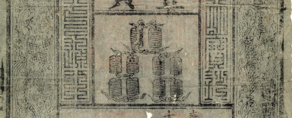

# Taller 1: transferencias

## Historia de los sistemas de pago

### Trueque de bienes

En las primeras civilizaciones, las transacciones se basaban en el trueque, donde bienes y servicios se intercambiaban directamente. Sin embargo, este sistema presentaba limitaciones, como la necesidad de coincidencia entre las necesidades de los involucrados.

### Metales preciosos

Con el tiempo, los metales preciosos, especialmente el *oro*, comenzaron a ser utilizados como medio de intercambio. El oro era altamente valorado por su **escasez**, **durabilidad**, **facilidad de transporte** y **divisibilidad**. Su uso **estandarizado** y **universal** como moneda marcó un avance importante en las economías, permitiendo el comercio a mayor escala.

### Effectivo

Posteriormente, surgió el uso de dinero en papel, o effectivo, como representación del valor de los metales preciosos. Este cambio fue impulsado por la necesidad de un sistema más práctico para manejar grandes cantidades de riqueza. Inicialmente, los billetes representaban depósitos de oro o plata almacenados en instituciones confiables, lo que facilitaba la **seguridad** y el transporte.

### Cuentas bancarias

Las cuentas bancarias surgieron como una solución práctica y segura frente a los riesgos y limitaciones de guardar todo el dinero en efectivo. Mantener grandes cantidades de efectivo implicaba un alto riesgo de robo, pérdida o deterioro. Además, el efectivo no ofrecía ninguna forma de generar interés o crecer con el tiempo. Los bancos comenzaron a ofrecer cuentas para proporcionar un lugar seguro donde las personas pudieran depositar su dinero, con la ventaja adicional de permitir transacciones más cómodas y registros claros.

### Reserva fraccional

Gradualmente, el sistema evolucionó hacia la banca de reserva fraccional. En este modelo, los bancos solo guardan una fracción de los depósitos como reserva, utilizando el resto para otorgar préstamos generando intereses. Esto permitió un crecimiento económico más dinámico, pero introdujo riesgos como los pánicos bancarios.

Los pánicos bancarios ocurren cuando un gran número de clientes retiran simultáneamente sus depósitos debido al temor de que el banco no tenga suficiente liquidez para cumplir con sus obligaciones.

### Bancos centrales

Los primeros bancos centrales se formaron para regular el sistema de reserva fraccionaria y reducir la incidencia de crisis bancarias. En un sistema donde los bancos solo mantienen una fracción de los depósitos en reserva, era crucial contar con una institución que pudiera supervisar las prácticas bancarias y actuar como prestamista de última instancia. Esto ayudaba a mantener la estabilidad financiera, prevenir pánicos bancarios y garantizar la confianza del público en el sistema monetario.

### SPEI

En el siglo XXI, los avances tecnológicos revolucionaron aún más los sistemas de pago. En México, uno de los ejemplos más destacados es el sistema SPEI (Sistema de Pagos Electrónicos Interbancarios), desarrollado por el Banco de México. SPEI permite transferencias electrónicas en tiempo real entre cuentas bancarias, proporcionando una herramienta rápida, segura y eficiente para la economía moderna. Este sistema ha facilitado tanto las operaciones comerciales como las transacciones cotidianas, marcando un nuevo capítulo en la historia de los pagos.

De esta manera, el dinero ha evolucionado desde el trueque y el oro hasta complejos sistemas digitales, reflejando la continua adaptación de las sociedades a las necesidades económicas.
